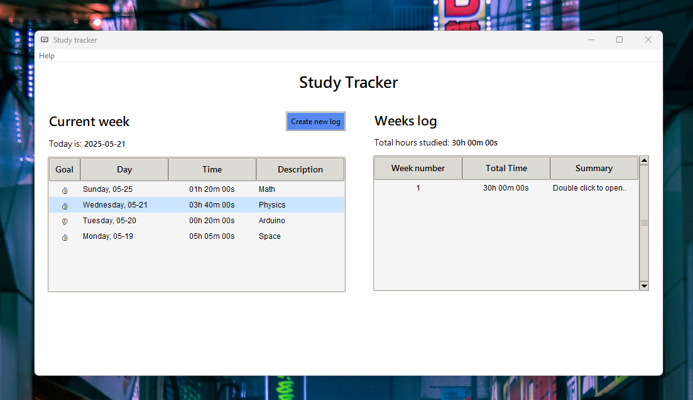

# Study Tracker

Minimal Study Tracker is a lightweight desktop app to help you track your study time and visualize your weekly progress. Built using Python and Tkinter, this app provides a simple and distraction-free way to stay productive.

## Preview


## Features
- Track your daily study time
- View study statistics for the past week
- Timer window can be pinned to be "on top" of everything
- Easy-to-use graphical interface built with Tkinter

## Installation
Download .exe file:
1. Donwload the lastest '.exe' file from the [Releases](https://github.com/matteoppet/Study-Tracker/releases) page
2. Run the executable - no installation required

Or install directly from [SourceForge](https://sourceforge.net/projects/studyarc/)

Install from Source:
```bash
git clone https://github.com/matteoppet/Study-Tracker.git
cd Study-Tracker
python main.py
```

> Step 1: To uninstall the app, go to the installation folder, default will be `C:\Program Files (x86)\Study Tracker` and run `unins000.exe`
> Step 2: Go to `C:\Users\(your user)\AppData\Roaming` and delete the folder `Study Tracker`

## Support the Project
If you find this project helpful, consider donating via the link in the Settings page of the app. Your support helps maintain and improve the tool! Thank you!