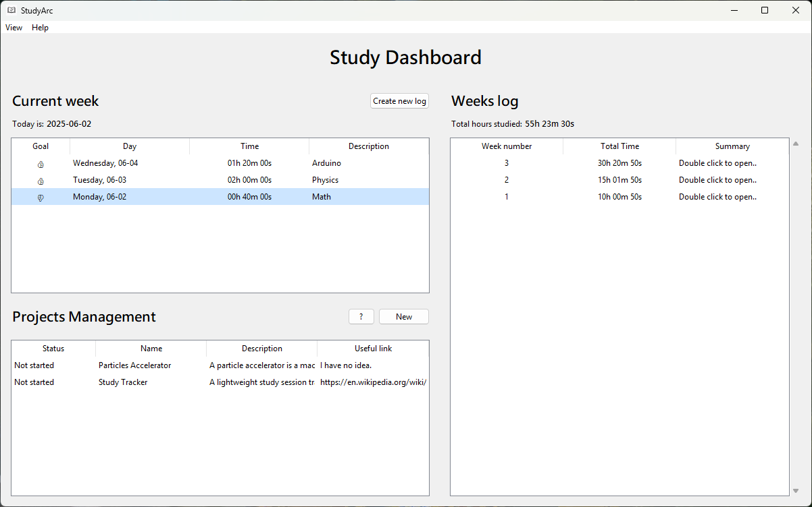

# StudyArc
**StudyArc** is a minimal study tracker desktop application designed to help monitor your study time, track your working-on or to-do projects -- with a task manager 
integrated in each project -- and also the possibility to visualize weekly progress.  
Built with **Python** and **Tkinter**, it offers a distraction-free interface to support focused and consisent productivity.

## Features
- Track daily study time
- View weekly study statistics
- Projects and Tasks management
- Timer window can stay always-on-top
- Simple and intuitive interface using Tkinter
- No internet needed

## Preview 


## Installation

### 1. Binary Installer
- Download `setup.exe` from the [Releases](https://github.com/matteoppet/Study-Tracker/releases) page  
- Run the installer
- Launch from Start Menu or Desktop

### 2. SourceForge
[](https://sourceforge.net/projects/studyarc/files/latest/download)

### 3. Run from Source
```bash
git clone https://github.com/matteoppet/studyarc.git
pip install -r requirements.txt
cd studyarc/src
python -m core.main
```

## Uninstall
Navigate to the install directory (default: `C:\Program Files (x86)\StudyArc`) and run `unins000.exe`.  
If you want to delete also the data files, navigate to `%appdata%` and delete the `StudyArc` directory

## Contributing
Open an issue or submit a pull request. Bug reports, feature ideas, and code improvements are all welcome.

## Support
If this tool helps you:
- Star the repository
- Share it with others
- Prove feedback via issues or discussions  
<br>Thank you to everyone!  

Donations are optional and can be made through the Settings page of the app.